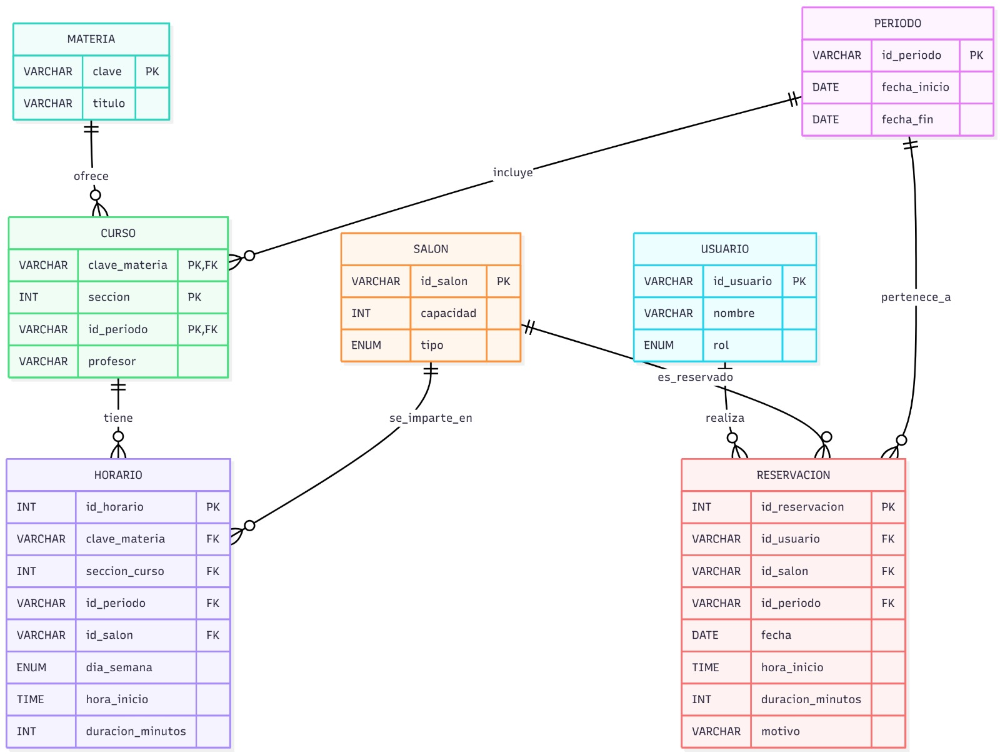

# Scheduleee for Dummies

A modular classroom management system built with **Python (Streamlit)** and **MariaDB**, containerized with **Docker**.

## 🚀 Quick Start

### Prerequisites
- [Docker Desktop](https://www.docker.com/products/docker-desktop/) installed.
- [uv](https://github.com/astral-sh/uv) installed (for local dependency management if needed).

### How to Run

1. **Sync dependencies** (optional, if running locally or checking dependencies):
   ```bash
   uv sync
   ```

2. **Start the application**:
   ```bash
   docker compose up --build
   ```

3. **Access the application**:
   Go to [http://0.0.0.0:8501](http://0.0.0.0:8501) (or [http://localhost:8501](http://localhost:8501)).

4. **Stop the application**:
   ```bash
   docker compose down
   ```

## 🏗 Architecture

This project is based on the architectural pattern called: **Command Query Responsibility Segregation (CQRS)**.

CQRS is a design pattern that segregates read and write operations for a data store into separate data models. This approach allows each model to be optimized independently and can improve the performance, scalability, and security of an application.



## 📂 Project Structure

```text
root/
├── config/             # Database configuration and initialization
│   ├── db.py
│   └── init.sql
├── modules/            # Business logic & UI components organized by domain
│   ├── auth/           # Authentication services and UI
│   ├── cursos/         # Courses management (Queries & Transactions)
│   ├── horarios/       # Schedule management (Queries & Transactions)
│   ├── reservaciones/  # Reservation logic (Queries & Transactions)
│   ├── salones/        # Classroom management (Queries & Transactions)
│   └── models.py       # Shared data models
├── static/             # Static assets (images, etc.)
├── utils/              # Helper functions
├── app.py              # Main application entry point
├── Dockerfile          # Container configuration
├── docker-compose.yml  # Service orchestration
├── pyproject.toml      # Project dependencies
└── uv.lock             # Dependency lock file
```

## ⚙️ Configuration

Environment variables are managed via `docker-compose.yml`.

Please refer to the `.env.example` file to see how environment variables should be defined in a `.env` file.

- **DB_USER**: `root`
- **DB_PASS**: `example_root_password`
- **DB_NAME**: `scheduleee`
